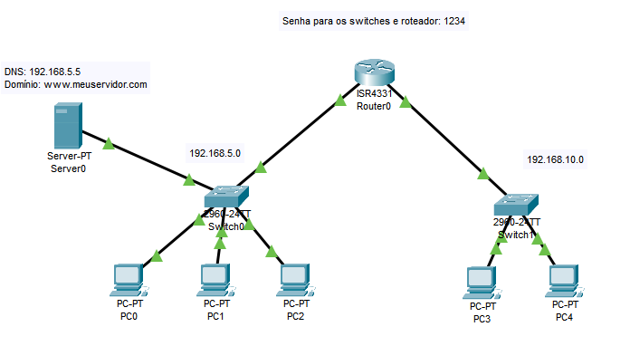

# Duas redes, um servidor DNS e uma página html
Passo a passo para configurar este projeto.
.

Objetivo: fazer as duas redes se comunicarem.

## Configurações básicas em cada switche (e roteador)
Hostname, banner, senha da console.

### Definindo um Hostname
Switch>enable
Switch#configure terminal
Switch(config)#hostname [nome]
> name: s1, s2, sterrio, s1piso, r1, r2 etc

### Colocando um Banner
Switch>enable
Switch#configure terminal
Switch(config)#banner motd # [mensagem] #
> mensagem: ACESSO RESTRITO, ACESSO PROIBIDO etc

### Colocando uma Senha
Switch>enable
Switch#configure terminal
Switch(config)#line console 0
Switch(config-line)#password [senha]
> senha: para os exercícios pode ser 1234, mas em caso real, uma forte
Switch(config-line)#login
Switch(config-line)#exit

### Salvando as configurações
Switch(config)#do copy running-config startup-config

### Reiniciando
Switch(config)#do reload

## Configundo os IPs

### No roteador
Router>enable
Router#configure terminal
Router(config)#interface gigabitethernet0/0/0
Router(config-if)#ip add 192.168.5.1 255.255.255.0 <- ip e submask do switch1>
Router(config-if)#no shutdown
Router(config-if)#exit

Router(config)#interface gigabitethernet0/0/1
Router(config-if)#ip add 192.168.10.1 255.255.255.0 <- ip e submask do switch2>
Router(config-if)#no shutdown
Router(config-if)#exit

## No servidor
Vá para `Desktop` -> `IP Configuration`:
Adicione manualmente o IPv4. Deve ser da mesma rede do switch.
O gateway é o IP do switch que foi definido no passo anterior.
Deixe o DNS é o próprio IP do servidor!

Vá para `Services` -> `DHCP`:
Service `ON`.
Adicione em Gateway e DNS Server, o mesmo que foi configurado anteriormente em IP configuration.
Start IP Address: mude o último número, por exemplo, se seu roteador termina em 1 e seu DNS em 2. Então o serviço DHCP deve começar pelo menor por 3.
Clique em `Save`.

Vá para `DNS`:
DNS Service `ON`.
Name: adicione um endereço. Como www.meuservidor.com
Address: o IP do servidor.
Clique em `Add`.

(Opcional) Em `HTTP` você pode configurar o site do servidor. 

### Manualmente nos computadores
> Isto para a rede em que o switch não está conectado a um servidor dhcp. Como a rede `192.168.10.0` neste exercício.

Em cada computador, vá para `Desktop` -> `IP Configuration`
Adicione manualmente o IPv4. Deve ser da mesma rede do switch.
O gateway é o IP do switch que foi definido no passo anterior.
DNS: ip do servidor da outra rede.

### Via DHCP
Em cada computador, vá para `Desktop` -> `IP Configuration`
Selecione `DHCP`. Se não aparecer mensagem de erro, significa que o tudo foi configurado corretamente.

## Teste
1. Testar com PDU (o ícone de email fechado na barra de ferramentas).
2. Testar em cada PC, vá para `Desktop` -> `Web Browser`. Digite o dominio do servidor DNS, se aparecer, signfica que tudo ocorreu certo.