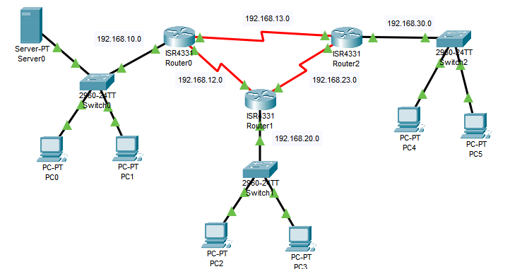

# Procolo RIP
Passo a passo para configurar este projeto.


**Requisitos:** utilizar roteadores com interfaces seriais (ex: `NIM-2T`) e **cabo serial DCE/DTE** para interligá-los.

**Objetivo:** Estabelecer comunicação entre PCs de redes diferentes usando o protocolo de roteamento dinâmico **RIP** e conexões seriais entre roteadores.

## 🛠️ 1. Adicionar interfaces seriais aos roteadores

➡️ Clique no roteador → `Physical` → **Desligue o roteador** → arraste o módulo **NIM-2T ou HWIC-2T** para um slot vazio → **Ligue novamente**.

## 🔌 2. Conectar os roteadores com cabos seriais

➡️ Use o **cabo serial (DCE)** entre as interfaces seriais (ex: `serial0/0/0`, `serial0/0/1`, etc).

## 🔧 3. Configurar IPs e interfaces em cada roteador

### Exemplo: Roteador 0

```bash
Router0>enable
Router0#configure terminal

# Rede interna
Router0(config)#interface gig0/0/0
Router0(config-if)#ip address 10.0.0.1 255.255.255.0
Router0(config-if)#no shutdown

# Serial para Router1
Router0(config)#interface serial0/1/1
Router0(config-if)#ip address 192.168.1.1 255.255.255.0
Router0(config-if)#no shutdown

# Serial para Router2
Router0(config)#interface serial0/1/0
Router0(config-if)#ip address 192.168.2.1 255.255.255.0
Router0(config-if)#no shutdown

Router0(config)#exit
Router0(config)#do write memory
```
➡️ Repita o mesmo nos outros roteadores, ajustando os IPs conforme sua topologia.

## 📡 4. Configurar RIP

Em todos os roteadores:

```bash
Router(config)#router rip
Router(config-router)#network 10.0.0.0      # rede local
Router(config-router)#network 192.168.1.0   # link serial com R1
Router(config-router)#network 192.168.2.0   # link serial com R2
Router(config-router)#exit
Router#write memory
```
➡️ Adapte os network conforme as redes de cada roteador.
➡️ Todas as interfaces com IP precisam ser incluídas para que o RIP funcione corretamente.

Para funcionar mesmo se um cabo for desconectado:
➡️ Inclua todas as redes conectadas no RIP. Assim, o protocolo pode recalcular rotas automaticamente e manter a comunicação entre as máquinas. Ou seja, em cada roteador, serão seis redes adicionadas no rip.

## 💻 5. Configurar IP nos PCs

➡️ Vá em cada PC → `Desktop` → `IP Configuration`
➡️ Adicione o IP da rede local e configure o **gateway** com o IP do roteador correspondente.

## 🧪 6. Testes

* Use o **PDU simples (ícone de carta)** para testar comunicação entre PCs de redes diferentes.
* Todos devem conseguir se comunicar se o RIP estiver propagando corretamente.