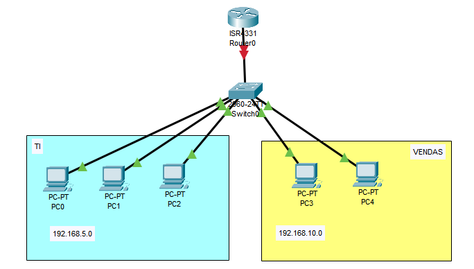

# VLAN
Passo a passo para configurar este projeto.
.

Objetivo: Criar uma rede com múltiplas VLANs para segmentar o tráfego entre diferentes grupos de computadores conectados ao mesmo switch, permitindo comunicação apenas entre dispositivos da mesma VLAN e controlando o tráfego entre elas via roteador (roteamento entre VLANs).

## Configurações básicas em cada switche (e roteador)
Hostname, banner, senha da console.

Segui os passos de configurações básicas no [ex1](../ex1-DHCP-DNS/passo-a-passo.md/#configurações-básicas-em-cada-switche-e-roteador)

## Criando as VLANs

Switch>enable

Switch#configure terminal

Switch(config)#vlan 2 <- o número de sua 
vlan, eu estou usando o 2>

Switch(config-vlan)#name TI <- o nome da vlan >

Switch(config-vlan)#exit

Switch(config)#vlan 3

Switch(config-vlan)#name VENDAS

Switch(config-vlan)#exit	

Switch(config)#do copy running-config startup-config

### Atribuindo portas as VLANs

Switch(config)#interface range fastethernet0/1-9 <- escolha as portas sendo usadas pelos PCs da VLAN>

Switch(config-if-range)#switchport access vlan 2

Switch(config-if-range)#exit

Switch(config)#interface range fastethernet0/10-19

Switch(config-if-range)#switchport access vlan 3

Switch(config-if-range)#end

Switch#write memory

## Configurando os IPs nos computadores

Em cada computador, vá para `Desktop` -> `IP Configuration`

Adicione manualmente o IPv4.

## Teste
1. Testar com PDU (o ícone de email fechado na barra de ferramentas) a comunicação entre dois computadores da mesma vlan. O resultado esperado é `sucesso`.
2. Testar com PDU (o ícone de email fechado na barra de ferramentas) a comunicação entre dois computadores vlans diferentes. O resultado esperado é `fail`.