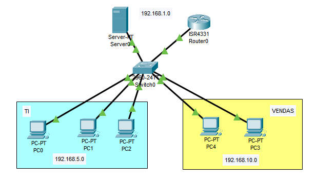

# VLAN com DHCP  
Passo a passo para configurar este projeto.  


**Objetivo:** Criar uma rede com múltiplas VLANs, utilizando `modo trunk` entre switches e um servidor DHCP para fornecer IPs automaticamente às VLANs.

## ⚙️ Configurações básicas (switches e roteador)

➡️ Siga os mesmos passos de configuração inicial do [ex1](../ex1-DHCP-DNS/passo-a-passo.md/): hostname, banner, senha, salvar e reiniciar.

## 🧩 Criando as VLANs

➡️ Primeiro, crie as VLANs normalmente (como no [ex2](../ex2-VLAN/passo-a-passo.md/)):
```bash
Switch(config)#vlan 2
Switch(config-vlan)#name TI
Switch(config-vlan)#exit

Switch(config)#vlan 3
Switch(config-vlan)#name VENDAS
Switch(config-vlan)#exit
```

## 🔁 Habilitando o modo trunk

```bash
Switch(config)#interface gigabitethernet0/1
Switch(config-if)#switchport mode trunk
Switch(config-if)#switchport trunk allowed vlan all
Switch(config-if)#do write memory
```
➡️ Isso permite que o switch envie tráfego de **múltiplas VLANs** por uma única porta.

## 🔌 Atribuindo portas às VLANs

➡️ Siga os mesmos passos do [ex2](../ex2-VLAN/passo-a-passo.md/), por exemplo:

```bash
Switch(config)#interface range fastethernet0/2-5
Switch(config-if-range)#switchport access vlan 2
Switch(config-if-range)#exit

Switch(config)#interface range fastethernet0/6-9
Switch(config-if-range)#switchport access vlan 3
Switch(config-if-range)#exit
```

## 📡 No Roteador (Subinterfaces para VLANs)

```bash
Router>enable
Router#configure terminal

Router(config)#interface gigabitethernet0/0/0
Router(config-if)#no ip address
Router(config-if)#no shutdown
Router(config-if)#exit

Router(config)#interface gigabitethernet0/0/0.1
Router(config-subif)#encapsulation dot1Q 1
Router(config-subif)#ip address 192.168.1.1 255.255.255.0
Router(config-subif)#ip helper-address 192.168.1.2
Router(config-subif)#exit

Router(config)#interface gigabitethernet0/0/0.2
Router(config-subif)#encapsulation dot1Q 2
Router(config-subif)#ip address 192.168.5.1 255.255.255.0
Router(config-subif)#ip helper-address 192.168.1.2
Router(config-subif)#exit

Router(config)#interface gigabitethernet0/0/0.3
Router(config-subif)#encapsulation dot1Q 3
Router(config-subif)#ip address 192.168.10.1 255.255.255.0
Router(config-subif)#ip helper-address 192.168.1.2
Router(config-subif)#exit

Router#write memory
```

➡️ Cada subinterface representa uma VLAN.
➡️ O comando `ip helper-address` direciona as requisições de DHCP para o **servidor DHCP centralizado** (neste caso, 192.168.1.2).

---

## 🖥️ No Servidor (DHCP + DNS)

Configure o IP do servidor:

```txt
IP:       192.168.1.2  
GATEWAY:  192.168.1.1  
DNS:      192.168.1.2
```

### Vá para `Services` → `DHCP` e crie 3 pools:

#### 🟢 Pool 1 (Rede do servidor - VLAN 1)

* Gateway: 192.168.1.1
* DNS: 192.168.1.2
* Save

#### 🔵 Pool 2 (VLAN 2 - TI)

* Pool name: Vlan2
* Gateway: 192.168.5.1
* DNS: 192.168.1.2
* Add

#### 🟠 Pool 3 (VLAN 3 - Vendas)

* Pool name: Vlan3
* Gateway: 192.168.10.1
* DNS: 192.168.1.2
* Add

## 🧑‍💻 Nos Computadores
Vá para `Desktop` → `IP Configuration ` e escolha **DHCP**.
➡️ Se os IPs forem atribuídos automaticamente e estiverem na faixa correta da VLAN, está tudo funcionando!

## ✅ Testes

1. Com **PDU (ícone de envelope)**, teste a comunicação entre dois PCs de **VLANs diferentes**.
   Resultado esperado: `✔️ Sucesso`.
2. Teste também acesso ao DNS (se configurado), por exemplo acessando um domínio via navegador.