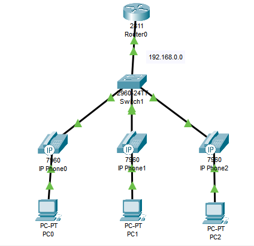

# VoIP
Passo a passo para configurar este projeto.  


* Requisitos: utilizar um roteador Cisco **2811**.

**Objetivo:** Criar uma rede com telefonia IP (VoIP), onde os telefones IP recebem IP via DHCP e números de ramais manuais.

## 🛠️ 1. Configurações básicas em switches e roteador

➡️ Siga os mesmos passos de configuração inicial do [ex1](../ex1-DHCP-DNS/passo-a-passo.md/): hostname, banner, senha, salvar e reiniciar.

## 🔧 2. Criar a VLAN de Voz

```bash
Switch>enable
Switch#configure terminal
Switch(config)#interface range fastethernet 0/1-3
Switch(config-if-range)#switchport mode access
Switch(config-if-range)#switchport voice vlan 1
Switch(config-if-range)#end
Switch#write
```
➡️ Atribui a VLAN de voz às portas onde estão conectados os telefones IP.

## 🌐 3. Configuração de IP no roteador (FastEthernet 0/0)

```bash
Router>enable
Router#configure terminal
Router(config)#no ip domain lookup
Router(config)#interface fastethernet 0/0
Router(config-if)#ip address 192.168.0.1 255.255.255.0
Router(config-if)#no shutdown
Router(config-if)#end
```
➡️ Configura o IP da interface conectada ao switch, para funcionar como gateway.

## 📦 4. Configuração do DHCP (com opção para telefones IP)

```bash
Router>enable
Router#configure terminal
Router(config)#ip dhcp pool voip
Router(dhcp-config)#network 192.168.0.0 255.255.255.0
Router(dhcp-config)#default-router 192.168.0.1
Router(dhcp-config)#option 150 ip 192.168.0.1
Router(dhcp-config)#exit
Router(config)#ip dhcp excluded-address 192.168.0.1
Router(config)#do write memory
```
➡️ Distribui IPs para os telefones IP e indica onde está o servidor TFTP via `option 150` (neste caso, o próprio roteador).

## 📞 5. Configuração do serviço de telefonia (CME)

```bash
Router> enable
Router# configure terminal
Router(config)# telephony-service
Router(config-telephony)# max-dn 3
Router(config-telephony)# max-ephones 3
Router(config-telephony)# ip source-address 192.168.0.1 port 2000
Router(config-telephony)# auto assign 1 to 3
Router(config-telephony)# exit
```
➡️ Habilita o serviço CME, define quantos ramais e telefones são permitidos e configura o IP para comunicação. A porta 2000 é padrão para o protocolo SCCP, que o Cisco usa pra sinalização de chamadas.

## 🔢 6. Definindo os ramais manualmente

```bash
Router(config)# ephone-dn 1
Router(config-ephone-dn)# number 1001
Router(config-ephone-dn)# exit

Router(config)# ephone-dn 2
Router(config-ephone-dn)# number 1002
Router(config-ephone-dn)# exit

# ... repita para cada telefone
Router# write memory
```
➡️ Cada `ephone-dn` representa um ramal. Aqui, estamos criando os números para os telefones IP.

## 🧪 7. Testes e finalizações

* Conecte os **telefones IP**, ligue a energia.
* Nos **computadores**, vá em `Desktop` → `IP Configuration` e clique em **DHCP**.
* Verifique se os telefones recebem IP e número automaticamente.
* Realize chamadas entre os ramais.
* Use o **PDU** para testar comunicação geral da rede.