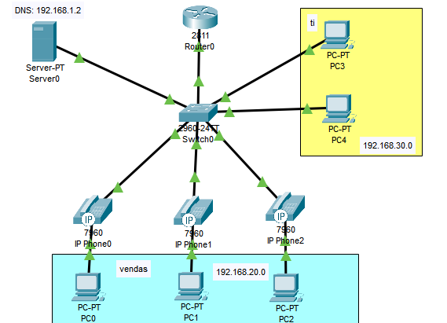

# VoIP com múltiplas VLANs e DHCP

Passo a passo para configurar este projeto.



**Objetivo:** Criar uma rede com múltiplas VLANs (TI, Vendas e VoIP), onde os telefones IP recebem IPs via DHCP e se registram automaticamente com ramais atribuídos via CME (Cisco Unified Communications Manager Express).

## 🛠️ 1. Configurações básicas
➡️ Repetir os passos de hostname, banner, senha e salvamento do [ex1](../ex1-DHCP-DNS/passo-a-passo.md) no roteador e no switch.

## 🖥️ 2. Servidor

### `Desktop` → `IP Configuration`

```text
IP: 192.168.1.2
Gateway: 192.168.1.1 
DNS: 192.168.1.2
```

### `Services` → `DHCP`

#### Pool 1 (rede nativa):

```text
Gateway: 192.168.1.1  
DNS Server: 192.168.1.2  
Start IP: 192.168.1.10  
→ Clique em `Save`
```

#### Pool 2 (VLAN Vendas):

```text
Pool name: vendas  
Gateway: 192.168.20.1  
DNS Server: 192.168.1.2  
Start IP: 192.168.20.10  
→ Clique em `Add`
```

#### Pool 3 (VLAN TI):

```text
Pool name: ti  
Gateway: 192.168.30.1  
DNS Server: 192.168.1.2  
Start IP: 192.168.30.10  
→ Clique em `Add`
```

## 🎛️ 3. Switch

➡️ Após as configurações básicas, execute a criação de VLANs e atribuição das portas:

### Criando as VLANs

```bash
Switch(config)# vlan 2
Switch(config-vlan)# name vendas
Switch(config)# vlan 3
Switch(config-vlan)# name TI
Switch(config)# vlan 10
Switch(config-vlan)# name VOIP
```

### Atribuindo portas

```bash
Switch(config)# interface range fastethernet0/1-3
Switch(config-if-range)# switchport mode access
Switch(config-if-range)# switchport access vlan 2
Switch(config-if-range)# switchport voice vlan 10
Switch(config-if-range)# mls qos trust cos
Switch(config-if-range)# spanning-tree portfast
Switch(config-if-range)# exit

# o mesmo para interface fa0/4-5
```
➡️ Depois, porta trunk para o roteador, como no [ex3](../ex3-VLAN-DHCP/passo-a-passo.md).

## 🌐 4. Roteador – Subinterfaces e DHCP

➡️ Após o básico, configure as subinterfaces para as VLANs e habilite o DHCP para a rede VoIP:

### Subinterfaces

```bash
Router(config)# interface fastethernet0/0
Router(config-if)# no ip address
Router(config-if)# no shutdown
Router(config-if)# exit

Router(config)# interface fastethernet0/0.1
Router(config-subif)# encapsulation dot1Q 1 native
Router(config-subif)# ip address 192.168.1.1 255.255.255.0
Router(config-subif)# ip helper-address 192.168.1.2
Router(config-subif)# exit

# faça o mesmo para as interfaces fastethernet0/0.2-3-10
```

## 📦 5. DHCP no roteador (para a VLAN VoIP)

```bash
Router(config)# ip dhcp excluded-address 192.168.1.1 192.168.1.9
Router(config)# ip dhcp excluded-address 192.168.10.1

Router(config)# ip dhcp pool VOIP
Router(dhcp-config)# network 192.168.10.0 255.255.255.0
Router(dhcp-config)# default-router 192.168.10.1
Router(dhcp-config)# option 150 ip 192.168.10.1
Router(dhcp-config)# exit
```

## 📞 6. Configurar telefonia IP (CME)

```bash
Router(config)# telephony-service
Router(config-telephony)# max-ephones 5
Router(config-telephony)# max-dn 5
Router(config-telephony)# ip source-address 192.168.10.1 port 2000
Router(config-telephony)# auto assign 1 to 5
Router(config-telephony)# create cnf-files
Router(config-telephony)# exit
```

## 🔢 7. Directory Numbers (Ramais)

➡️ Crie um por telefone (como nos outros exemplos):

```bash
Router(config)# ephone-dn 1
Router(config-ephone-dn)# number 2001
Router(config-ephone-dn)# exit

Router(config)# ephone-dn 2
Router(config-ephone-dn)# number 2002
Router(config-ephone-dn)# exit

# ... repita até 3
Router# write memory
```

## ✅ 8. Testes

* Ligue os telefones e verifique se recebem IP via DHCP.
* Teste se os ramais funcionam.
* Use o **PDU** para testar comunicação geral.
* PCs também devem obter IP conforme a VLAN e navegar normalmente.
