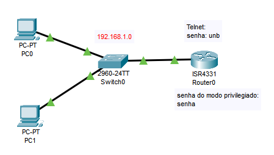

# 💻 Telnet – Acesso Remoto Não Seguro

Passo a passo para configurar acesso remoto via **Telnet**.


**Objetivo:** Permitir o acesso remoto a roteadores via Telnet para fins de estudo e laboratório.
⚠️ *Atenção: Telnet **não é seguro**, pois transmite dados sem criptografia. Use apenas em ambientes de testes.*

## 🛠️ Preparar a rede (endereçamento IP)

➡️ Configure os IPs nos PCs e defina os gateways para garantir conectividade básica:

### Nos PCs:
➡️ Para cada PC, vá em `Desktop` -> `IP configuration`
```text
PC0 → IP: 192.168.1.100   Gateway: 192.168.1.1  
PC1 → IP: 192.168.1.101   Gateway: 192.168.1.1
```

## 🛠️ 1. Configuração básica do Telnet no roteador

```bash
Router> enable
Router# configure terminal
Router(config)# hostname unb

unb(config)# line vty 0 4
unb(config-line)# password unb        # senha simples para acesso remoto
unb(config-line)# login
unb(config-line)# exit
```
➡️ Com isso, o roteador passa a aceitar conexões Telnet. A senha é obrigatória.

## 🌐 2. Ativar a interface com IP

```bash
unb(config)# interface gigabitEthernet0/0/0
unb(config-if)# ip address 192.168.1.1 255.255.255.0
unb(config-if)# no shutdown
unb(config-if)# exit
```

➡️ Essa interface será usada pelos PCs para acessar o roteador via Telnet.

## 🔐 3. Proteger o modo privilegiado

```bash
unb(config)# enable secret senha
```

➡️ Depois de entrar via Telnet, o usuário estará no modo `>` e precisará dessa senha para usar comandos privilegiados (`#`).
➡️ O `secret` garante que a senha será armazenada **criptografada**.

## 🔒 4. Criptografar senhas visíveis (opcional, mas boa prática)

```bash
unb(config)# service password-encryption

unb(config)# do write memory
```

➡️ Isso **ofusca** senhas simples (como a da VTY) no `show running-config`.

## ✅ 5. Testar o Telnet

No **terminal do PC**:

```bash
telnet 192.168.1.1
```

**Etapas esperadas:**

1. Vai pedir a senha da VTY → digite: `unb`
2. Você entra no modo `>`
3. Digite `enable` → vai pedir a senha do modo privilegiado
4. Digite: `senha`
5. Você está no modo `#` (acesso total ao roteador)