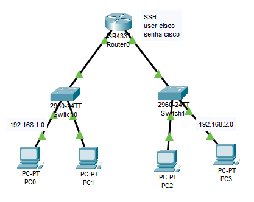

# 🔐 Acesso Remoto com SSH

Passo a passo para configurar acesso remoto **seguro** a roteadores e switches usando o protocolo **SSH**.


**Objetivo:** Permitir que dispositivos de rede (roteadores e switches) possam ser acessados remotamente com **criptografia**, evitando exposição de senhas ou dados sensíveis.

## 🛠️ 1. Preparar a rede (endereçamento IP)

➡️ Configure os IPs nos PCs e defina os gateways para garantir conectividade básica:

### Nos PCs:
➡️ Para cada PC, vá em `Desktop` -> `IP configuration`
```text
PC0 → IP: 192.168.1.100   Gateway: 192.168.1.1  
PC1 → IP: 192.168.1.101   Gateway: 192.168.1.1
PC2 → IP: 192.168.2.100   Gateway: 192.168.2.1  
PC3 → IP: 192.168.2.101   Gateway: 192.168.2.1  
```
### Nos switches:

No switch0:
```bash
Switch>enable
Switch#configure terminal
Enter configuration commands, one per line.  End with CNTL/Z.
Switch(config)#ip default-gateway 192.168.1.1
Switch(config)#do wr
```
➡️ Faça a mesma coisa no switch1, mas trocando o **gateway** de 192.168.1.1 para **192.168.2.1**.

## 🧾 2. Configurar o Roteador para aceitar SSH

### A) Definir identidade do roteador (pré-requisito para SSH)

```bash
R1>enable
R1#configure terminal
R1(config)# hostname R1
R1(config)# ip domain-name cisco.com
```

### B) Gerar a chave de criptografia

```bash
R1(config)# crypto key generate rsa
# → Quando pedir o tamanho da chave, digite: 1024
```
➡️ Essa chave é o que torna o SSH seguro.

### C) Criar usuário e senha locais

```bash
R1(config)# username cisco secret cisco
```
➡️ Esse será o login para o SSH.

### D) Configurar as linhas VTY

```bash
R1(config)# line vty 0 15
R1(config-line)# transport input ssh   # ← Aceita apenas SSH
R1(config-line)# login local           # ← Usa o usuário criado acima
R1(config-line)# exit
```

### E) (Boa prática) Forçar versão 2 do SSH 

```bash
R1(config)# ip ssh version 2
```
## 🌐 3. Ativar as interfaces do roteador

```bash
# Interface da rede 1
R1(config)# interface gigabitEthernet0/0/0
R1(config-if)# ip address 192.168.1.1 255.255.255.0
R1(config-if)# no shutdown
R1(config-if)# exit

# Interface da rede 2
R1(config)# interface gigabitEthernet0/0/1
R1(config-if)# ip address 192.168.2.1 255.255.255.0
R1(config-if)# no shutdown
R1(config-if)# exit

R1(config)#do write memory
```
## ✅ 4. Testar o SSH

### No terminal do PC:
Em `Desktop` -> `Prompt de Comando`.

```bash
ssh -l cisco 192.168.1.1
```

➡️ `-l cisco` = login como usuário "cisco"
➡️ Será pedida a senha (neste caso: `cisco`)
➡️ Se tudo estiver certo, você terá acesso remoto seguro ao roteador.